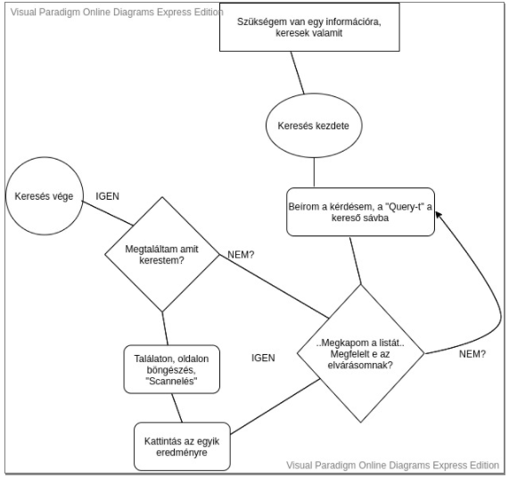
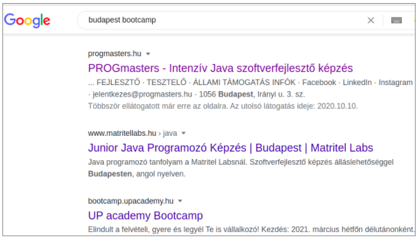

## SEO, a weboldal keresőoptimalizálása
Hogy mindig megtaláljanak

### SEO 
#### Search Engine Optimization
**Egy weboldal Kereső Oldalakon történő megjelenések optimalizálása..**

Sokan nem fektetnek nagy hangsúlyt rá, pedig döntő fontosságú, ha egy oldal megjelenését, rangsorolását szeretnék erősíteni az internetes kereső oldalakon. Mik is az általános elemei a SEO-nak?

- taktikák, stratégiai megoldások arra hogy minél előkelőbb helyen jelenjen meg a weboldal a találtatok között
- taktikák, hogy a felhasználok minél több időt töltsenek el az oldalunk, hogy és visszatérjenek hozzánk


Mik a legnépszerűbb kereső motorok, website-ok?

- Google     ==>  https://www.google.com
- Yahoo      ==>  https://yahoo.com
- Bing         ==>  https://bing.com

A legnépszerűbb közöttük, akit senkinek sem kell bemutatni a Google. Minimális törtélnemi kitekintés, hogy alakultak ki a mai algoritmusok és rangsorolások a legnépszerűbb kereső motorokban:

A 2000-2010-es évek között hatalmasat ugrott az internetet látogatók és a weboldalak száma. Sokan meg akarták ragadni a lehetőséget, hogy minél több felhasználót oldalukra csábítsák. Sok jelentéktelen, vagy rossz szándékú oldal is megjelent a piacon.
2011-ben a Google változtatott az algoritmusain ez volt a "Panda Update". Céljai voltak:

- Kizárja a többszöri link felhasználást, olyan oldalakat kontrollálva, amik csak azért jöttek létre, hogy egy adott oldalra mutassanak
- Megtévesztő linkeket tartalmazó oldalak kizárása
- Leginkább releváns találatokat adjon vissza a kereső

###A keresők működése

De hogy is működnek ezek a kereső robotok ( web-crawler-ek )? Két fő feladatuk van:

1. Kategorizálása, indexelése az internetes oldalaknak, tartalmaknak
2. Keresésre adott eredmények megjelenítése, pontosítása és rangsorolása

**Kategorizálás** esetén nem a tartalom kategorizálásról beszélünk. Egy robot nem tudja még pusztán egy szövegből eldönteni, hogy jó, valós adatokat, tényeket közöl vagy sem. Amit felismer az oldal mögött álló HTML tartalom, HTML Tag-ek.

**Keresésre adott válaszokban**, pontosításokban arra törekszik hogy az első 2 oldalon a leginkább megfelelő válaszokat adja vissza keresésbe megnevezett feltételnek.

Kereső motorok a Single-Page alkalmazásokon.

Külön témakört érdemel a kérdés hiszen, ha ismerjük a SPA felépítését, akkor tudjuk hogy az alap HTML felépítés és tartalom igen minimális. A javascriptes tartalom rendereli be az oldal tartalmát. Hogyan lássa ezt a kereső motor, ha nincsen éppen berenderelve az oldal? Erre is van már megoldás. A kereső-motor "pre-rendereli az oldalt" hogy lássa a főbb tartalmakat. ("késleltetve olvassa igy a tartalmakat")

###Egy felhasználó keresési folyamata:

Nézzük meg ehhez az alábbi ábrát: 



A fenti ábra jól összefoglalja lényeget, hogy miért fontos nem csak az a szempont, hogy megjelenjen kiemelt helyen az oldalunk, hanem hogy sikerüljön megfogni az a böngésző alanyt, ne lépjen azonnal tovább ( vissza más találat weboldalra )az oldalunkról.
Úgy is kifejezhetjük, ránéz az oldalunkra, a találatra és azonnal kiszúrva a számára fontos dolgokat.

Itt jönnek képbe a kulcsszavak (Keyword) fontossága.

- Ne csak egy szóba, komplett mondatban fogalmazzuk meg az oldal kulcs mondanivalóját (ne feledjük egy jó weboldal egy választ ad egy kérdésre!)
- Kerüljük a túlzott általánosításokat címszavainkban, kulcs mondatainkban. pl: "Ők", "mi ", "Este volt" ..


Azokat a kulcs szavakat, túlzásba vitt "meta adatokat" (így azok az oldalakat is), amik túl sok találatot adnak vissza, kizárják a keresők, hogy gyorsítsák a találatokat.
Nézzük meg, hogy most mit adnak vissza találtok:

###Search Engine Result Pages (SERPS)


A találatok két fő elemet jelenítenek meg:

1. Title (cím), amit mi fejlesztők adunk meg meta adatként, "meta title"-ként. 60 karakternél leszokták vágni a találatkor
2. Description (leírás). A talált oldal bevezető szövege, amit a kereső motor automatikusan kivág belőle,
vagy amit "meta description-ként" adunk meg. (kb. 150-160 karaktert jelenítenek meg a találatban)

###Végül egy kivonat, milyen egy alap meta tartalom felépítése:
```html
<head>
  <meta charset="UTF-8">
  <meta name="viewport" content="width=device-width, initial-scale=1.0">
  <meta name="title" content="Beszédes címkék hasznossága">
  <meta name="robots" content="index,follow">
  <meta name="description" content="Megtanulhatjuk hogy miért fontos a SEO-ban hogy a jó leírás is">
  <meta name="keywords" content="cimke, tanulás, leírás, SEO">
  <title>Document</title>
</head>
```

## On Page SEO
- 5 fő elem csoport van egy weboldal html tartalmában, amivel mi fejlesztők támogatni tudjuk a weboldalunk készítésekor a SEO-t
    - Title (cím)
    - URL
    - Content (Tartalom)
    - Headings (Fejlécek)
    - Images (Képek)

Ezek megfelelő használata a kereső motorokat tudja támogatni a kategorizálásban. Ha nem tudja egyértelműen azonosítani az elemeket, témaköröket, akkor kereséskor nem fog megjelenni az oldal.

### Title (cím, fejezet)
Itt a HTML felépítés Title címkéjének tartalmáról beszélünk elsősorban:

```html
<html lang="hu">
<head>
    <meta charset="UTF-8">
     <meta name="viewport" content="width=device-width, initial-scale=1.0">
     <title>Hogyan építsünk piramist Floating gyakorlással</title>
</head>
<body>
```

- Egyértelműnek kell lennie. Nem lehet zavaró, vagy félrevezető üzenete. Megjelenhet a weboldalon is mint tartalom (pl: címe egy cikknek)
- Oldal tartalmára utalnia kell
- Tartalmazza az oldalon található "key word" -öt, kulcsszavat
- A felhasználó azonnal el tudja dönteni miről szól az oldal
- A felhasználó mindig egy kérdésre keres választ ==> "Megoldást" nyújtson a Title egy kérdésre 

#### Amit a kereső motorok még kifejezetten könnyen értelmeznek:
- 20-60 karakter szám között
- 2 és maximum 20 szó között

#### Néhány rossz példa: 
- ```<title> képek </title>```
- ```<title> programozó suli </title>```
- ```<title> gyerekek </title>```

#### Néhány jó példa:
- ```<title> ingyenes képek letöltési lehetősége </title>```
- ```<title> legnépszerűbb budapesti programozó iskolák </title>```
- ```<title> hogyan készítsük fel gyermekünk az iskolára </title>```

Fontos megjegyzés: egy html tartalom meta adataiban (<meta> címkéinek tartalmaiban ) is segíthetünk a kereső motoroknak azonosítani a legfontosabb információkat, de ezeket a legújabb algoritmusok már kezdik figyelmen kívül hagyni, a túlzott meta tartalmak elterjedése miatt.

### URL

Egy weboldal és aloldalainak a címsorban megjelenő tartalmairól beszélünk:
```moz.com/blog/15-seo-best-practices-for-structruring-urls```
- egyértelműen tartalmazza az oldal fő üzenetét
- gyakran megegyezik az oldal Title és URL tartalma (finoman kiegészítője lehet, vagy egy felesleges szóval kevesebb lehet az egyik a másiknak)
- informatív legyen. Lehetőleg ne egy átlagos szó: "cikk", "post", "mi"

#### Néhány rossz példa: 
- myblog/cikk1
- bloggeroldal/post
- familytree-pages/mi 

#### Néhány jó példa: 
- myblog/hogyan-keszitsunk-tanyasi-levest
- bloggeroldal/legjobb-etterem-tippek-dunakeszin
- familytree-pages/luc-imre-csaladja

### Content (tartalom)

Az oldal tartalmi megjelenéséről beszélünk. A kereső mindig összehasonlítja a tartalmat a Title-ben és az URL-ben megfogalmazott tartalommal.
Fontos szempont a felhasználó olvasási élményének növelése, hisz célunk, hogy minél több időt töltsön el oldalunkon!

- Legalább 3 helyen tartalmazza a kulcsszavakat (témát amit a Title-ben megjelöltünk)
- Lehet 1-1 helyen finomítani egy címben szereplő fogalmat: pl eBook ==> digital book
- Egy szekció tartalmi részt bontsunk fel bekezdésekre. 3-4 bekezdés maximum egy szekción belül.
- Max 10-15 sor legyen egy bekezdés
- Bekezdések között tartsunk sörtöréseket
- Használjunk kiemeléseket a fontos fogalmakra (dőlt betűk, vastag betűs szavak)
- Ha több gondolatunk, felsorolásunk lenne, használjunk lista elemeket
- Dobjuk fel képekkel az oldal tartalmát

### Heading (fejezetek)

Kiemelt fontossága van a megfelelő fejezet címeknek! Itt a `<h1>` -től `<h6>` jelölt html elemekről beszélünk

- Minden oldalnak kell lenni egy, azaz egy darab `<h1>` címkével ellátott tartalomnak, címnek
- A kereső motor egy oldalon a `<h1>`,`<h2>`, `<h3>` címeket kutatják fel
- Használjunk felvezetést a különböző méretű heading típusokban:
- Legnépszerűbb eBook olvasók Magyarországon

### Images (képek)
Az oldalon megjelenített képekről beszélünk itt,amik nagyban növelik a felhasználó élményt.

- Mindig használjuk a  html tartalom  címkéjében az "alt" attribútumot. pl: ``. ezt az alt-t értéket letudják olvasni a kereső robotok (és a screen-reader-ek is). Bátran használhatunk a Title-re vontakozó szabályokat itt is (20-60 karakter, jól formázott mondat is lehet)
- A képet mindig formázzuk, meg és állítsuk be közepes vagy kis méretet mielőtt feltöltsük, csökkentve az oldal betöltését


Fontos üzenet: az interneten fellelhető képek, nem a mi tulajdonunk!! Szabálysértést, lopást követhet el az ki más oldalról letöltött képeket használ fel publikálás alatt engedély nélkül!

Nem kell profi design-ernek lennünk ha jó képeket akarunk. Néhány eszköz és oldal ahonnan képeket tudunk letölteni, szerkeszteni:

- [canva.hu](https://www.canva.com/hu_hu/) - saját képek tartalmak készítése, alap lehetőségként ingyenes
- [unsplash](https://unsplash.com/) - sok ingyenes tartalom
- [storyblocks](https://www.storyblocks.com/) - minimális összegekért lehet képet vásárolni


Most nézzük meg, hogyan lehet még tovább fokozni az elérhetőséget az  ún. Off Page SEO eszközeivel.

## Off Page SEO
Mint említettük nem csak meg akarjuk jeleníteni oldalunkat a találatok között.
Szeretnék a felhasználó eltöltött idejét is növelni az oldalunkon.
Szeretnék, hogy miután megtalálták és megfelelően kategorizálták  a robotok az oldalunkat, minél kiemeltebb helyen jelenjen meg a találatok között.  

Tehát itt a webtartalmak rangsorolásáról beszélünk.  

Nézzük mik befolyásolják a találati rangsort:  

- Site History. Megfelelő SEO és Szemantikai elemek. Vannak e spam-re vagy hacker oldalakra utaló linkek?
- Traffic Trends (Forgalom és látogatottság). Nőnek vagy csökkennek az oldal látogatottságai?
- Site Age (az oldal/domain kora). Legalább 1 éves oldal már jó mutatókat hozhat
- Content (Tartalom). Ne legyen az oldalon (felesleges) tartalmi ismétlések
- Az oldalra mutató linkek mennyisége. Hány másik oldalról (domain-ről) van erre az oldalra mutató link. Illetve összesen hány darab link mutat az oldalunkra  
Összegezhetjük a fentiek alapján, hogy a kereső robotok magát a szöveges tartalmat nem tudják értelmezni. De a látogatottságot és felhasználók bizalmát az oldal felé azt igen!

Könnyű megérteni már, hogy az olyan népszerű oldalak, mint a Facebook, Amazon, Google miért jelennek meg mindig az első találatok között. Nem csak azért, mert "sokan ismerik". Weboldalak ezrei, linkek milliói mutatnak ezekre a webalkalmazásokra.  

Így kiemelt szerepe van a SEO-ban a weboldalunkra mutató linkek, mint "tőkék" halmozásának.
Ezért is fontos, hogy olyan tartalmat készítsünk, amik megoszthatók közösségi felületeken:

- Facebook, Twitter, Instagram
- Fórumokon
- Kommentekben
